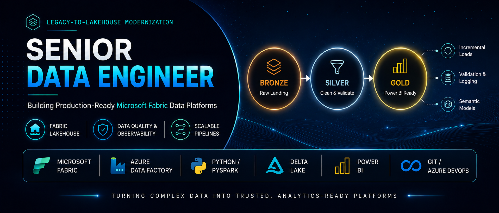

# 👋 Hi, I'm Bill Walker

**Senior Data Engineer | Databricks • PySpark • dbt • SQL**  
Building scalable data platforms and modern lakehouse architectures

---

## 🚀 About Me

I’m a Senior Data Engineer with 18+ years of experience evolving from SQL-based systems into modern cloud and distributed data platforms.

- 🔧 Started with SQL Server, ETL, and enterprise data systems  
- ☁️ Transitioned into AWS & Azure cloud environments  
- ⚡ Now focused on Databricks, PySpark, dbt, and lakehouse architecture  

I specialize in:
- Designing scalable data pipelines (batch & streaming)
- Modernizing legacy systems into cloud-native platforms
- Building analytics-ready data models
- Improving performance, reliability, and data quality

---

## 🧱 Featured Projects

### 🔹 Real-Time Data Pipeline (Databricks + PySpark)
Production-style lakehouse pipeline using:
- Medallion architecture (bronze → silver → gold)
- Structured Streaming
- Delta Lake

👉 [View Project](https://github.com/YOUR_USERNAME/databricks-realtime-lakehouse-pipeline)

---

### 🔹 Analytics Engineering Platform (dbt)
Modern transformation framework with:
- Star schema modeling
- Data quality testing
- CI/CD integration

👉 [View Project](https://github.com/YOUR_USERNAME/dbt-lakehouse-analytics-platform)

---

## ⚙️ Tech Stack

**Data Engineering**
- Databricks
- PySpark
- SQL
- dbt
- Delta Lake

**Cloud**
- Azure (ADF, Azure SQL)
- AWS (S3, Redshift)

**Engineering Practices**
- CI/CD
- Git
- Data Modeling
- Data Architecture

---

## 📈 What I'm Working On

- Building production-grade Databricks pipelines
- Deepening PySpark performance optimization skills
- Expanding dbt + CI/CD workflows
- Creating reusable data engineering templates

---

## 🤝 Let's Connect

- 💼 LinkedIn: https://linkedin.com/in/billpaulwalker
- 📧 Email: billpaulwalker@gmail.com

---

## ⚡ Fun Fact

I enjoy solving data problems that require system thinking, tradeoffs, and scalable design.

---
